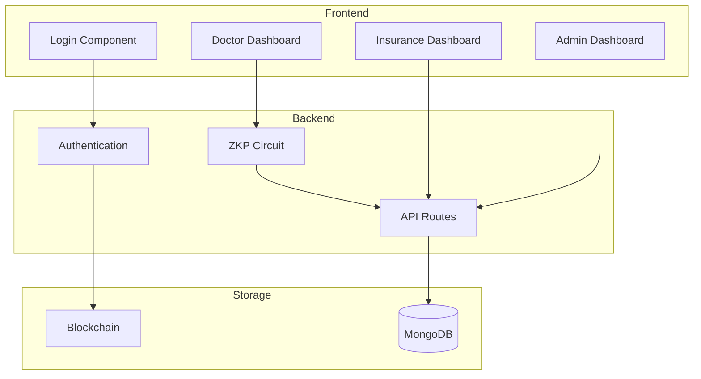
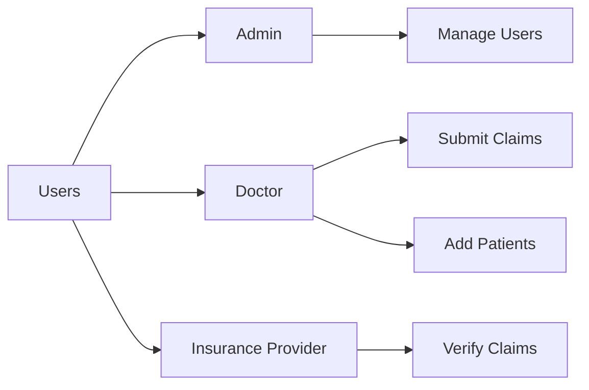
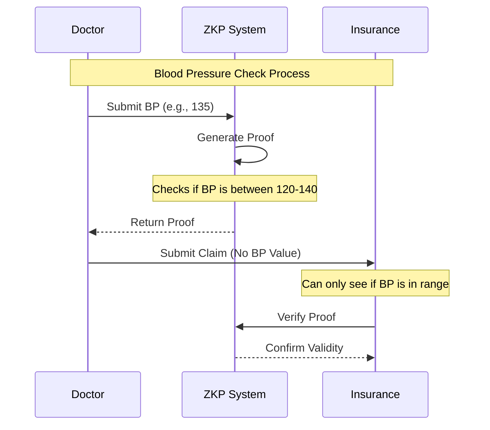
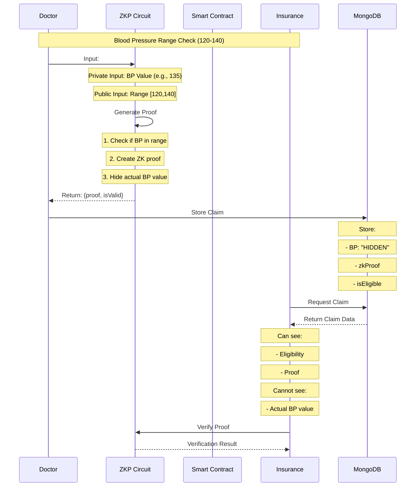
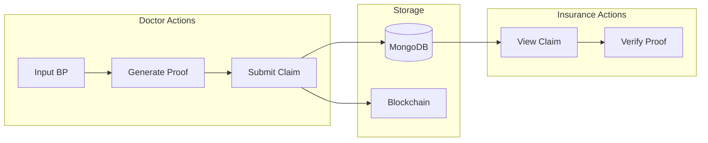
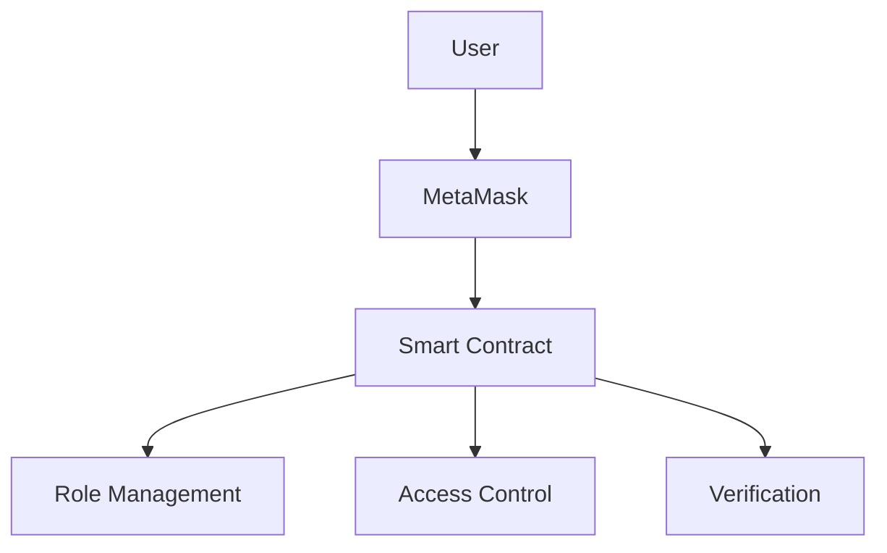

## Workflow 



## Components Breakdown

### 1. User Roles
We have three types of users:



#### Admin
- Can manage system users
- View all registered users
- Enable/disable features

#### Doctor
- Register patients
- Submit blood pressure claims
- View patient history

#### Insurance Provider
- View claims
- Verify eligibility
- Cannot see actual blood pressure values

### 2. Privacy Protection (ZKP Flow)





### 3. Technical Components

#### Frontend Components
1. **Login Component** (`src/components/auth/Login.js`)
   - Handles user authentication
   - Connects to MetaMask
   - Redirects based on role

2. **Doctor Dashboard** (`src/components/dashboard/Dashboard.js`)
   ```javascript
   // Key features
   - Submit claims
   - Register patients
   - View history
   ```

3. **Insurance Dashboard** (`src/components/insurance/InsuranceDashboard.js`)
   ```javascript
   // Key features
   - View claims
   - Verify proofs
   - Track eligibility
   ```

#### Backend Components
1. **ZKP Circuit** (`backend/circuits/bloodPressureRange.circom`)
   ```circom
   // Simplified version of our ZKP circuit
   template RangeCheck() {
       signal private input bloodPressure;
       signal input minRange;
       signal input maxRange;
       signal output inRange;
   }
   ```

2. **API Routes** (`backend/routes/`)
   - Authentication
   - Claims processing
   - User management

### 4. Data Flow



### 5. Privacy Features

1. **Zero-Knowledge Proofs**
   - Proves BP is in range without revealing actual value
   - Uses cryptographic techniques
   - Mathematically verifiable

2. **Data Protection**
   ```javascript
   // Example of how data is stored
   {
       patientId: "DM-001",
       bloodPressure: "HIDDEN",
       zkProof: "proof_data",
       isEligible: true
   }
   ```

### 6. Smart Contract Integration



### 7. How to Use

#### For Doctors:
1. Login with MetaMask
2. Navigate to Dashboard
3. Enter patient's blood pressure
4. Submit claim
5. System generates proof automatically

#### For Insurance Providers:
1. Login with MetaMask
2. View submitted claims
3. Verify proofs
4. See eligibility without actual values

## Security Considerations

1. **Privacy**
   - Blood pressure values never stored
   - Only proofs and eligibility stored
   - Zero-knowledge verification

2. **Access Control**
   - Role-based access
   - Smart contract enforcement
   - Secure authentication

## Technical Requirements
- Node.js
- MongoDB
- MetaMask
- Web3 compatibility


