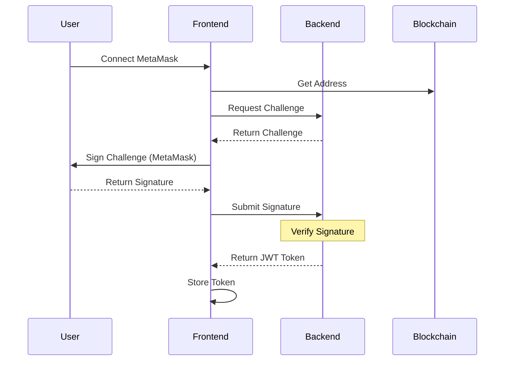
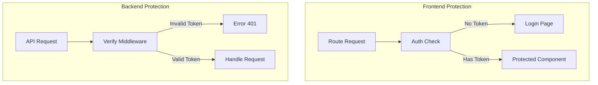
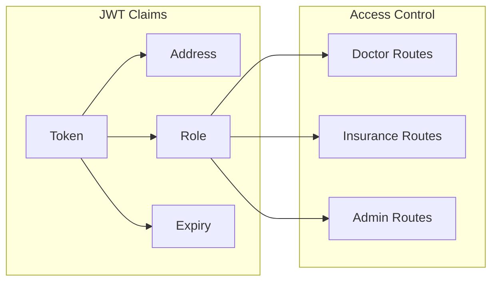
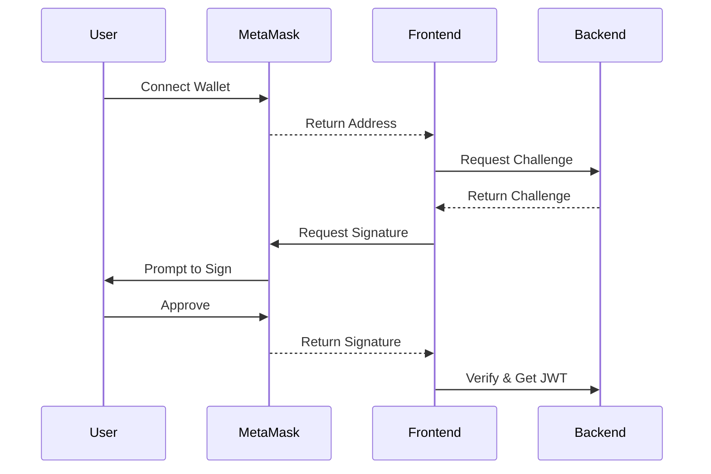

# JWT Authentication in Healthcare ZKP System

## Overview



## Implementation Details

### 1. Authentication Flow

```javascript
// AuthContext.js
const login = async () => {
    try {
        // 1. Connect to MetaMask
        const { signer, address } = await connectWallet();
        
        // 2. Get user role from blockchain
        const role = await contract.getUserRole(address);
        
        // 3. Sign message for JWT
        const signature = await signMessage(
            `Login to Healthcare ZKP System\nNonce: ${nonce}`,
            signer
        );
        
        // 4. Store JWT
        localStorage.setItem('auth_token', signature);
        localStorage.setItem('user', JSON.stringify({
            address,
            role,
            token: signature
        }));
    } catch (error) {
        console.error('Login error:', error);
    }
};
```

### 2. JWT Token Structure

```javascript
// Backend token generation
const token = jwt.sign(
    {
        address: user.address,
        role: user.role,
        nonce: generateNonce()
    },
    process.env.JWT_SECRET,
    { expiresIn: '24h' }
);
```

### 3. Protected Routes



### 4. Middleware Implementation

```javascript
// auth.middleware.js
const verifyToken = (req, res, next) => {
    const token = req.headers.authorization?.split(' ')[1];
    
    if (!token) {
        return res.status(401).json({ 
            message: 'No token provided' 
        });
    }
    
    try {
        const decoded = jwt.verify(token, process.env.JWT_SECRET);
        req.user = decoded;
        next();
    } catch (error) {
        return res.status(401).json({ 
            message: 'Invalid token' 
        });
    }
};
```

### 5. Role-Based Access Control



### 6. Security Features

1. **Token Storage**
   ```javascript
   // Secure storage in localStorage
   localStorage.setItem('auth_token', token);
   ```

2. **Token Refresh**
   ```javascript
   // Refresh token before expiry
   const refreshToken = async () => {
       const currentToken = localStorage.getItem('auth_token');
       // Implement refresh logic
   };
   ```

3. **Logout Handling**
   ```javascript
   const logout = () => {
       localStorage.removeItem('auth_token');
       localStorage.removeItem('user');
       setUser(null);
   };
   ```

### 7. Integration with MetaMask



## Error Handling

```javascript
try {
    // Verify JWT
    const decoded = jwt.verify(token, process.env.JWT_SECRET);
    
    // Check role permissions
    if (!hasPermission(decoded.role, requiredRole)) {
        throw new Error('Insufficient permissions');
    }
    
} catch (error) {
    if (error.name === 'TokenExpiredError') {
        // Handle expired token
    } else if (error.name === 'JsonWebTokenError') {
        // Handle invalid token
    } else {
        // Handle other errors
    }
}
```

## Best Practices Implemented

1. **Token Security**
   - Short expiration time
   - Secure storage
   - HTTPS only

2. **Role Validation**
   - Double validation (Frontend & Backend)
   - Role-based routing
   - Permission checks

3. **Error Management**
   - Proper error messages
   - Automatic logout on token expiry
   - Refresh token mechanism

## Testing Authentication

1. **Login Flow**
```bash
# Test login process
1. Clear localStorage
2. Connect MetaMask
3. Sign message
4. Verify JWT received
```

2. **Protected Routes**
```bash
# Test route protection
1. Try accessing protected route without token
2. Access with invalid token
3. Access with expired token
4. Access with valid token
```

3. **Role Verification**
```bash
# Test role-based access
1. Login as Doctor
2. Attempt Insurance routes
3. Login as Insurance
4. Attempt Admin routes
``` 