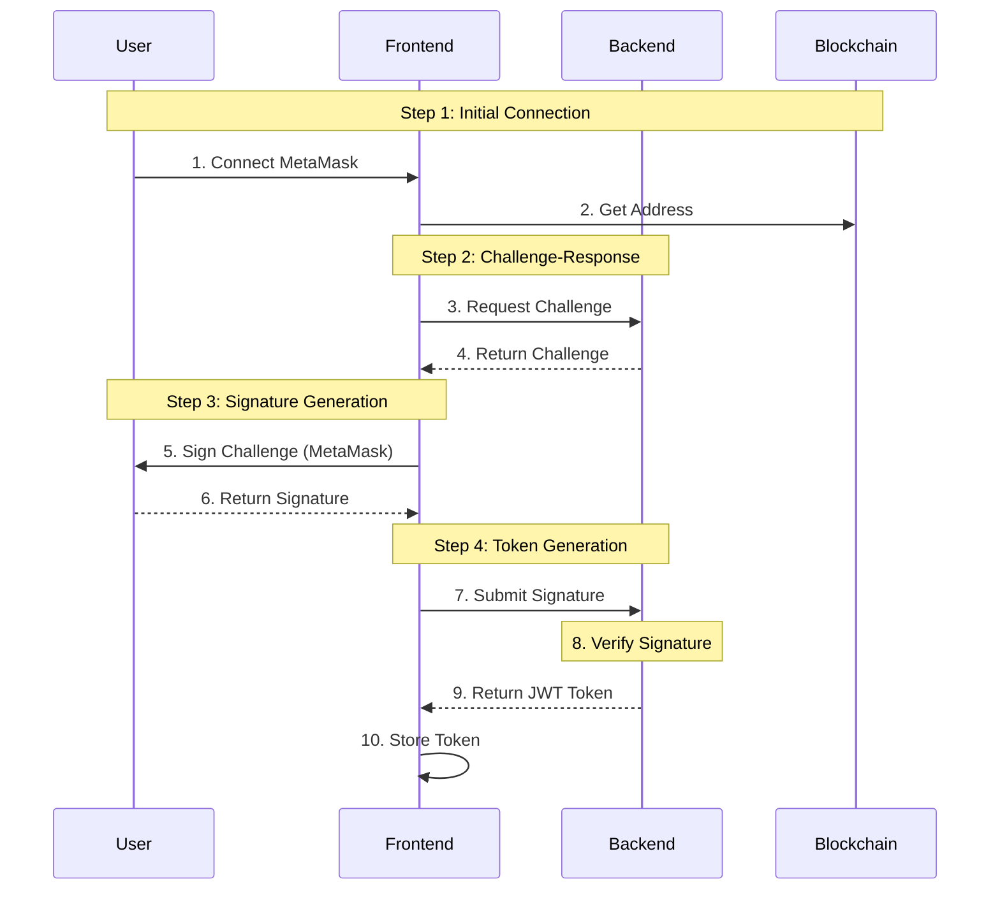
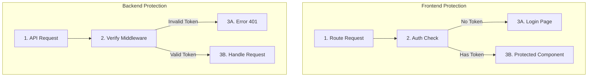
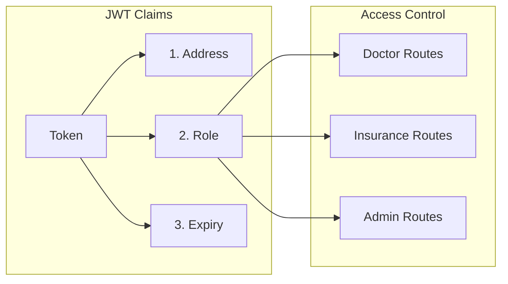

# JWT Authentication in Healthcare ZKP System

## 1. Authentication Flow Overview



### Explanation:
1. **Initial Connection (Steps 1-2)**:
   - User clicks "Connect" button
   - MetaMask popup appears
   - System gets user's Ethereum address

2. **Challenge-Response (Steps 3-4)**:
   - Backend generates unique challenge
   - Prevents replay attacks
   - Challenge includes timestamp

3. **Signature Generation (Steps 5-6)**:
   - User signs message with private key
   - Proves ownership of address
   - MetaMask handles signing

4. **Token Generation (Steps 7-10)**:
   - Backend verifies signature
   - Generates JWT with user role
   - Frontend stores token securely

## 2. Implementation Details

### Authentication Flow Code
```javascript
// AuthContext.js
const login = async () => {
    try {
        // Step 1: Connect MetaMask
        const { signer, address } = await connectWallet();
        
        // Step 2: Get role from blockchain
        const role = await contract.getUserRole(address);
        
        // Step 3: Sign message
        const signature = await signMessage(
            `Login to Healthcare ZKP System\nNonce: ${nonce}`,
            signer
        );
        
        // Step 4: Store JWT
        localStorage.setItem('auth_token', signature);
        localStorage.setItem('user', JSON.stringify({
            address,
            role,
            token: signature
        }));
    } catch (error) {
        console.error('Login error:', error);
    }
};
```

### Explanation:
- **connectWallet()**: Handles MetaMask connection
- **getUserRole()**: Fetches role from smart contract
- **signMessage()**: Creates cryptographic proof of ownership
- **localStorage**: Securely stores session data

## 3. JWT Token Structure

```javascript
// Backend token generation
const token = jwt.sign(
    {
        address: user.address,  // Ethereum address
        role: user.role,        // User role (admin/doctor/insurance)
        nonce: generateNonce()  // Unique nonce for security
    },
    process.env.JWT_SECRET,
    { expiresIn: '24h' }       // Token expires in 24 hours
);
```

### Explanation:
- **address**: Links token to specific user
- **role**: Determines access permissions
- **nonce**: Prevents token reuse
- **expiresIn**: Forces periodic re-authentication

## 4. Protected Routes System



### Explanation:
1. **Frontend Protection**:
   - Checks token presence
   - Redirects unauthorized users
   - Handles token expiry

2. **Backend Protection**:
   - Validates token authenticity
   - Checks user permissions
   - Secures API endpoints

## 5. Role-Based Access Control



### Explanation:
1. **Token Claims**:
   - Address: User identifier
   - Role: Access level
   - Expiry: Security timeout

2. **Route Protection**:
   - Each route checks role
   - Prevents unauthorized access
   - Maintains separation of concerns

## 6. Security Features

1. **Token Storage**:
```javascript
// Secure storage implementation
localStorage.setItem('auth_token', token);
```

2. **Token Refresh**:
```javascript
const refreshToken = async () => {
    const currentToken = localStorage.getItem('auth_token');
    // Implement refresh logic
};
```

3. **Logout**:
```javascript
const logout = () => {
    localStorage.removeItem('auth_token');
    localStorage.removeItem('user');
    setUser(null);
};
```

### Explanation:
- **Storage**: Secure token storage in browser
- **Refresh**: Maintains session validity
- **Logout**: Cleans up session data

## 7. Testing Authentication

1. **Login Flow Test**:
```bash
# Step-by-step test process
1. Clear localStorage
2. Connect MetaMask
3. Sign message
4. Verify JWT received
```

2. **Protected Routes Test**:
```bash
# Security testing steps
1. Try accessing protected route without token
2. Access with invalid token
3. Access with expired token
4. Access with valid token
```

### Explanation:
- Ensures security measures work
- Validates user experience
- Confirms proper error handling