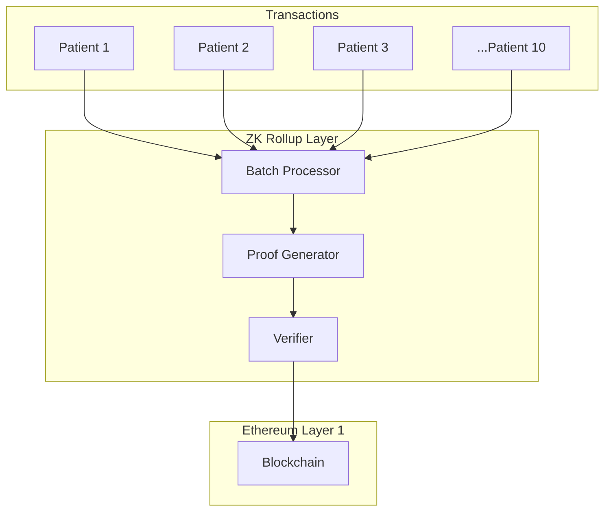
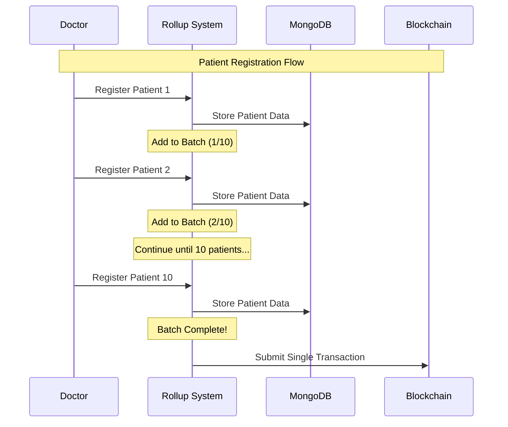
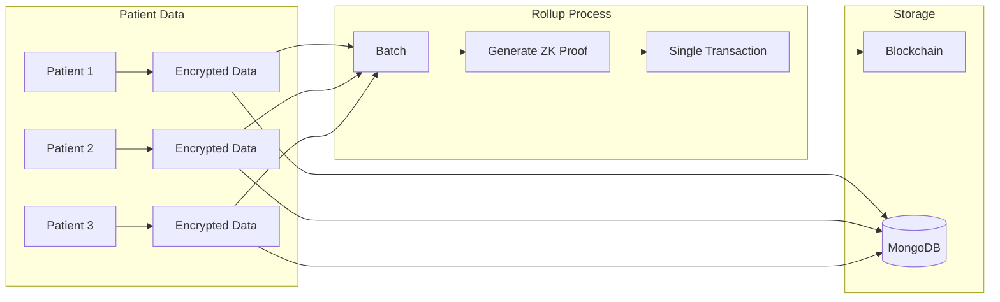
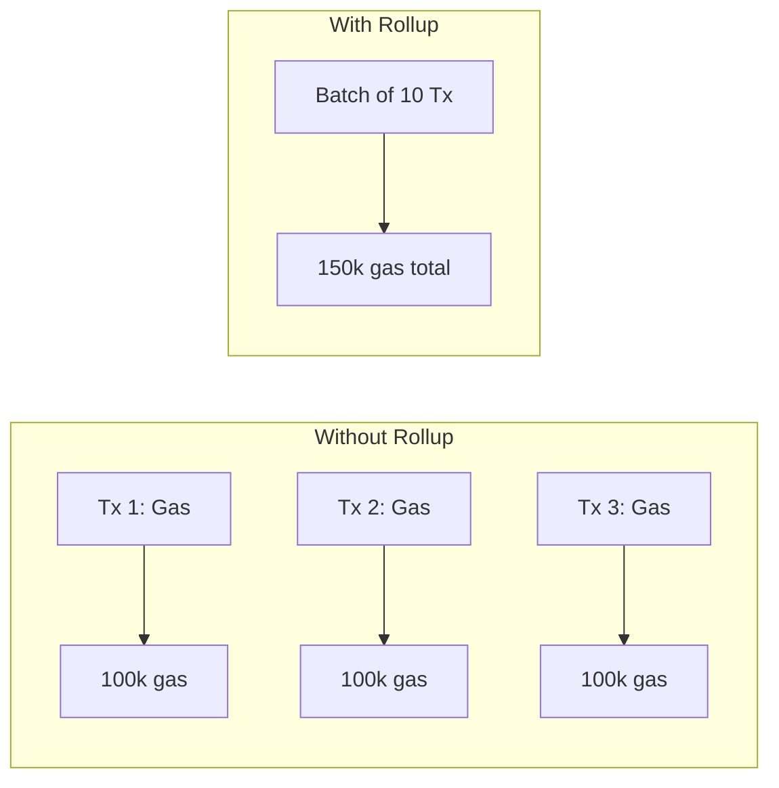
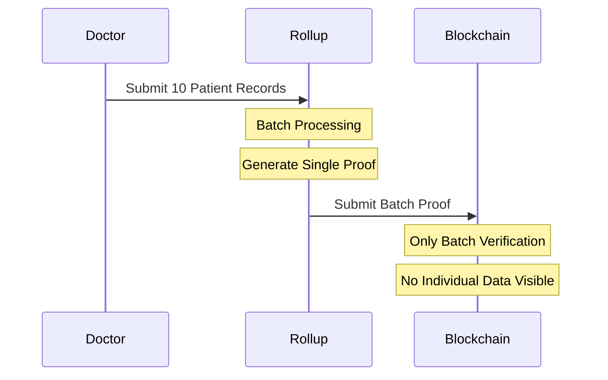
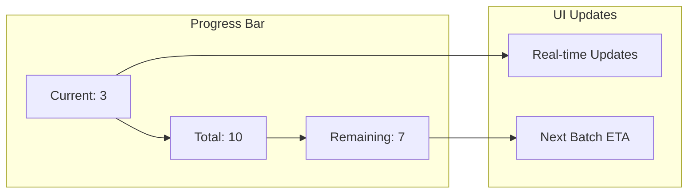
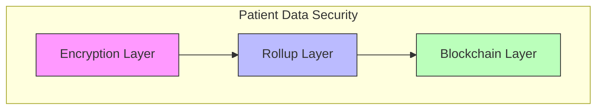
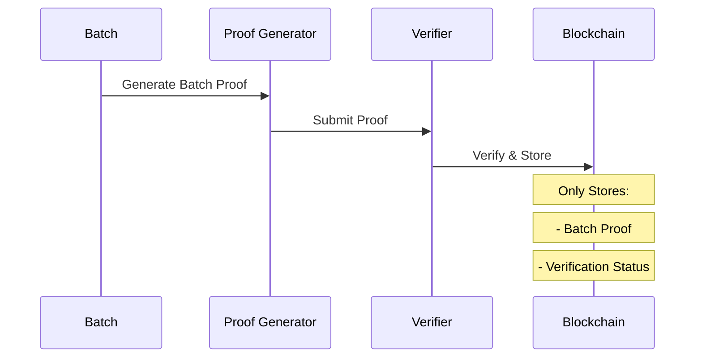

# ZK Rollups in Healthcare System

## What are ZK Rollups?



## Our Implementation

### 1. Batch Collection


### 2. Data Flow


## Benefits in Our System

1. **Gas Optimization**


2. **Privacy Enhancement**


## Technical Implementation

### 1. Batch Collection
```javascript
class PatientRollup {
    constructor() {
        this.batch = [];
        this.batchSize = 10;
    }
    
    async addToBatch(patient) {
        this.batch.push(patient);
        if (this.batch.length >= this.batchSize) {
            return this.processBatch();
        }
        return null;
    }
}
```

### 2. Progress Tracking


## Security Considerations

1. **Data Privacy**


2. **Verification Process**


## Usage in Production

1. **Monitoring**
- Track batch progress
- Monitor gas savings
- Verify batch proofs

2. **Optimization**
- Dynamic batch sizes
- Gas price consideration
- Priority processing

## Future Improvements
1. Dynamic batch sizing based on gas prices
2. Priority queue for urgent registrations
3. Enhanced batch verification mechanisms
4. Real-time monitoring dashboard 